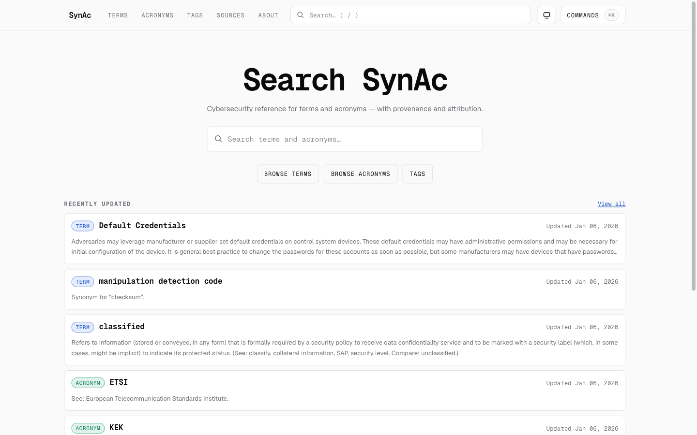
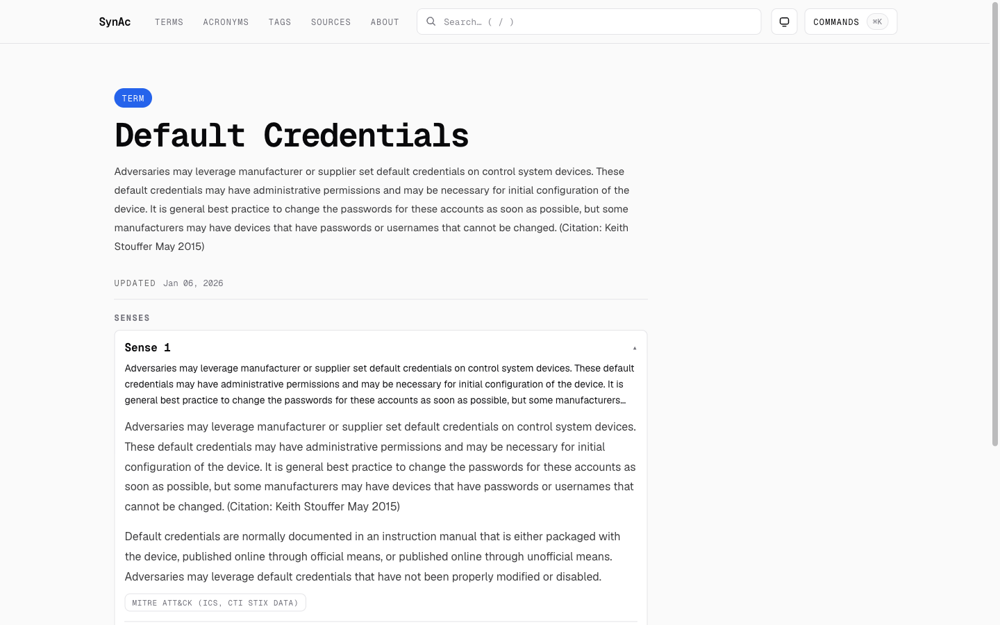

# SynAc

SynAc is a public, internet-facing cybersecurity glossary built for practitioners: clear disambiguation, strong provenance, and explicit attribution.

Canonical domain: `https://synac.app`.

  

## Why this exists

Security terms are overloaded. Acronyms collide. Vendor marketing rewrites meanings. One person’s “SOC” is another person’s “SOC”.

SynAc is trying to be the thing you open when you want to answer:

- “What does this mean *here*?”
- “Which definition is supported by an actual source?”
- “Where did this wording come from?”

## What makes SynAc different

- **Senses (multiple meanings) are first-class.** One entry can have multiple meanings with direct links.
- **Provenance is built in.** Definitions carry citations, source metadata, and license notes.
- **Terms and acronyms are treated differently.** `/term/*` and `/acronym/*` have canonical routing with redirects.
- **Curated taxonomy.** Tags are a maintained classification system (not a free-for-all).

  

## Quickstart (local dev)

Prereqs:
- Node `22.21.1` (see `.node-version`)
- pnpm `10.27.0` (see `package.json#packageManager`)
- A local Postgres database

Docs: `docs/contributing/local-dev.md`

Fast path:
1. Copy `.env.example` → `.env.local` (do not commit `.env*`).
2. Migrate + seed:
   - `pnpm db:migrate`
   - `pnpm db:seed`
3. Run:
   - `pnpm dev`

Verification gate (before PRs): `pnpm gate`.

## Contributing

If you want to help, the highest-leverage contributions are usually:
- Fixing unclear or incorrect docs
- UI/UX + accessibility polish on the public site
- Content corrections *with sources* (open an issue; see templates)

Start here:
- `CONTRIBUTING.md`
- `CODE_OF_CONDUCT.md`
- `GOVERNANCE.md`
- `SUPPORT.md`

Contribution boundary (by design): **docs + public web only**. Changes to ingest/DB/worker/admin/API require maintainer approval.

## Project docs

- Product/spec: `SPEC.md`
- Execution tracker: `PLAN.md`
- Ops + runbooks: `docs/` (index: `docs/README.md`)

## Content & licensing

SynAc publishes content sourced from third parties with their own licenses and attribution requirements. The repository’s MIT license does **not** override third-party content licenses.

Policy: `docs/content/licensing.md`

## Roadmap

See `ROADMAP.md`.

## Security

For vulnerability reporting, see `SECURITY.md` (please do not open public issues for security reports).

## License

MIT (see `LICENSE`).
