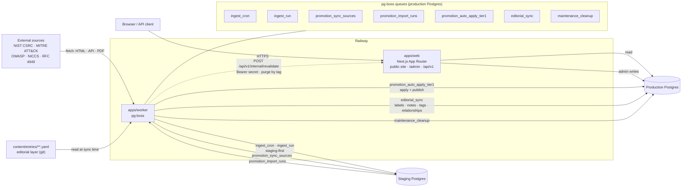

# Architecture overview

SynAc is a public glossary with a strong emphasis on provenance and
attribution.

## Monorepo layout

- `apps/web`: public site + internal admin UI + API routes (Next.js App Router)
- `apps/worker`: background jobs (pg-boss)
- `packages/db`: Prisma schema, migrations, and query layer
- `packages/shared`: shared TypeScript utilities
- `content/`: the editorial layer as YAML (`content/entries/**/*.yaml`)

## System diagram

## Runtime components

### Web (`apps/web`)

- Serves public pages: home, browse, search, entry pages
- Renders citations and source metadata
- Serves the public read API under `/api/v1` (see `docs/api.md`)
- Hosts the internal admin surface under `/admin/*` (Clerk-authenticated)

### Database (Postgres)

Two databases, not one:

- Production is the system of record for published entries, senses, tags,
  sources, and the audit log. The web app reads and writes only this one.
- Staging is where ingest runs land first. Nothing reaches production without
  passing the license gate and the promotion path.

Search is implemented with Postgres FTS + `pg_trgm`, at both entry level
(`entry_search`) and meaning level (`sense_search`), maintained by triggers
(see `SPEC.md`).

### Worker (`apps/worker`)

Runs every background job through pg-boss, using the production database for
queue storage. Three families of work:

**Ingest** (`ingest_cron`, `ingest_run`) fetches from registered external
sources on each source's cron schedule, parses and normalizes, and writes
proposed changes as ingest items into the **staging** database. Every item is
scored by the license gate on the way in.

**Promotion** (`promotion_sync_sources`, `promotion_import_runs`,
`promotion_auto_apply_tier1`) implements staging-first ingest: source
definitions are pushed to staging, validated runs are imported back, and Tier 1
items that clear the license gate are applied and published into production.
`WARN` items stop for human review; `FAIL` items never publish. See
`docs/content/licensing.md` and `docs/runbooks/ingest-promotion.md`.

**Editorial and maintenance** (`editorial_sync`, `maintenance_cleanup`).
`editorial_sync` reads the `content/**` YAML out of the repository and applies
it to production as editorial-provenance changes: sense labels, disambiguation
notes, preferred-sense selection, tag assignments, and relationships. It is
idempotent and never overwrites source attestations
(`docs/content/editorial-layer.md`). `maintenance_cleanup` handles periodic
housekeeping, expiring rate-limit buckets and other bounded-retention rows.

The worker's role is set by `SYNAC_WORKER_MODE` (`ingest`, `promotion`, or
`all`), so ingest and promotion can run as separate services against different
databases.

## Caching

Public pages **render dynamically**. There is no static export and no
full-page ISR. What is cached is the data underneath: each `@synac/db` loader
call in the page layer is wrapped in Next.js `unstable_cache` and labelled with
cache tags. A page render is then cheap because its queries are served from
cache, while the page itself is always assembled fresh for the request.

### Tag vocabulary

The tag names are a contract between the page layer (which declares them) and
the write paths (which purge them). They live in `apps/web/src/lib/cacheTags.ts`.

| Tag                   | Covers                                                                                                  |
| --------------------- | ------------------------------------------------------------------------------------------------------- |
| `entries`             | Any listing that can contain an entry                                                                   |
| `tags`                | The tag taxonomy and its counts                                                                         |
| `sources`             | The source registry                                                                                     |
| `search`              | Search results                                                                                          |
| `entry:<TYPE>:<slug>` | One entry's page. Emitted in both `TERM`/`term` casings, because the DB enum and the URL segment differ |
| `tag:<slug>`          | One tag's page                                                                                          |
| `source:<slug>`       | One source's page                                                                                       |

### How a change invalidates

Invalidation is **by tag, not by time**. A content change is visible on the
next request rather than after a TTL expires.

- An admin write in the web app (publish, archive, rollback, tag
  create/rename/merge, source enable/disable) calls the matching
  `revalidate*` helper inside the request, which purges the entry's own tags,
  every listing tag that could contain it, and `search`. An entry rename also
  purges its previous slugs, so a cached page at the old URL cannot survive.
- A change made outside the web process, such as the worker running
  `editorial_sync` or promotion publishing an entry, cannot call
  `revalidateTag` directly, because that only works inside a Next.js request
  scope. It instead calls `POST /api/v1/internal/revalidate` with a
  `Bearer $SYNAC_REVALIDATE_SECRET` header and the list of tags to purge. The
  endpoint is internal and is rejected without the secret.
- A deploy starts from an empty cache. The first request for each resource
  repopulates it; no warm-up step is required.

Invalidation is best-effort by design: `revalidateTag` throws when called
outside a request scope, and the helpers log and continue rather than failing
the write. A page that is stale for a few seconds is a much better outcome than
a publish that fails.

API responses layer HTTP caching on top: every public `GET` carries an `ETag`,
honours `If-None-Match` with a `304`, and sets `Cache-Control` for shared
caches. See `docs/api.md`.

## Source of truth docs

- Product + engineering spec: `SPEC.md`
- Implementation tracker: `PLAN.md`
- Public API: `docs/api.md`
- Runbooks and ops notes: `docs/`
